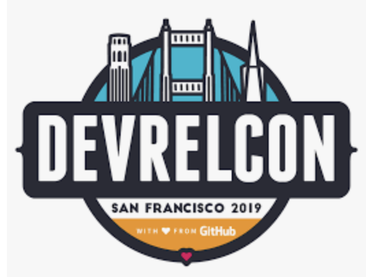

## Event URL: [https://bit.ly/2IqATCK](https://bit.ly/2IqATCK)

# 09-06-13-SF-Lunch-and-Learn

## Let's start with the code:

### [Writing your first application in Node,js in Hyperledger Fabric](https://hyperledger-fabric.readthedocs.io/en/release-1.4/write_first_app.html#writing-your-first-application)

### IBM Cloud sign-up link: [https://ibm.biz/Bdzqsf](https://ibm.biz/Bdzqsf)

### IBM Cloud Catalog link: [https://cloud.ibm.com/catalog/](https://cloud.ibm.com/catalog)

### IBM Blockchain in the IBM Cloud: [https://cloud.ibm.com/catalog?search=blockchain](https://cloud.ibm.com/catalog?search=blockchain)

### [Kubernetes Cluster](https://cloud.ibm.com/kubernetes/catalog/cluster) in the IBM Cloud

### [Visual Studio Code](https://code.visualstudio.com)

### [https://marketplace.visualstudio.com/items?itemName=IBMBlockchain.ibm-blockchain-platform](https://marketplace.visualstudio.com/items?itemName=IBMBlockchain.ibm-blockchain-platform)

### [https://github.com/hyperledger/fabric](https://github.com/hyperledger/fabric)

## How did it all start?

During the Global Financial Crisis in 2008: 

Oct 2008. It all started with Satoshi Nakamoto and his paper [BitCoin: A Peer-to-Peer Electronic Cash System](https://bitcoin.org/bitcoin.pdf) which addressed a key problem in electronic commerce:

<i><b>
A purely peer-to-peer version of electronic cash would allow online payments to be sent directly from one party to another without going through a financial institution. 

 
Digital signatures provide part of the solution, but the main benefits are lost if a trusted third party is still required to prevent double-spending. 

We propose a solution to the double-spending problem using a peer-to-peer network.</i></b> 

# [Hyperledger Fabric 1.4](https://hyperledger-fabric.readthedocs.io/en/release-1.4/index.html)

Enterprise grade permissioned distributed ledger platform that offers modularity and versatility for a broad set of industry use cases.

1. [Hyperledger Fabric’s First long term support release](https://hyperledger-fabric.readthedocs.io/en/release-1.4/whatsnew.html#raft-ordering-service)

1. [Raft ordering service](https://hyperledger-fabric.readthedocs.io/en/release-1.4/whatsnew.html#raft-ordering-service) 

[Blockchain Use Cases](https://www.ibm.com/blockchain/use-cases/)

[IBM Blockchain Garage Services](https://www.ibm.com/blockchain/garage)

[Hyperledger Fabric: DLT Distributed Ledger Technology Smart Contract Engine ](https://www.hyperledger.org/projects/fabric)

[Hyperledger Fabric source](https://github.com/hyperledger)

[Hyperledger Fabric ReadTheDocs](https://hyperledger-fabric.readthedocs.io/en/release-1.4/)

## News

[Does Hyperledger Fabric perform at scale?](https://www.ibm.com/blogs/blockchain/2019/04/does-hyperledger-fabric-perform-at-scale/)

[Forbes: Blockchain Goes To Work At Walmart, Amazon, JPMorgan, Cargill and 46 Other Enterprises](https://www.forbes.com/sites/michaeldelcastillo/2019/04/16/blockchain-goes-to-work/#3aa207de2a40)

[Why new off-chain storage is required for blockchains](https://www.ibm.com/downloads/cas/RXOVXAPM)

## IBM Blockchain Twitter feeds:

Christopher Ferris IBM Fellow CTO Open Technology https://twitter.com/christo4ferris

Arnaud J Le Hors. Senior Technical Staff Member: https://twitter.com/lehors

Christian Cachin. https://twitter.com/cczurich?lang=en

IBM Blockchain: https://twitter.com/ibmblockchain?lang=en

Mark Parzygnat.Program Director IBM Blockchain: https://twitter.com/meetmarkp?lang=en

# Table of Contents

## Introduction

[An introductioon to programming Hyperledger Fabric](https://www.slideshare.net/LennartF/ibp-technical-introduction)

[IBM Blockchain Platform](https://www.slideshare.net/LennartF/ibm-blockchain-platform-explained-149106072)

[IBM Blockchain Solutions](https://www.slideshare.net/LennartF/ibm-blockchain-solutions-149098151)

## Hands-on-lab : Developing smart contracts with Visual Studio Code extension 

[Install IBM Blockchain Platform VS Code extension for free](https://cloud.ibm.com/docs/services/blockchain?topic=blockchain-develop-vscode#develop-vscode-install)

[Download Visual Studio Code](https://code.visualstudio.com/)

[Install IBM Blockchain Platform ](https://marketplace.visualstudio.com/items?itemName=IBMBlockchain.ibm-blockchain-platform)

Go through Tutorial One: Local Smart Contract Development.
Follow the typicalworkflow from generating a new smart contract project, deploying code to the <i>local_fabric_runtime</i> and testing your transactions via an application gateway</i> 

[IBM Blockchain Platform 1.2](https://cloud.ibm.com/catalog/services/blockchain-platform)

## Where do we go from here? 
 
[Build a blockchain insurance app](https://developer.ibm.com/patterns/build-a-blockchain-insurance-app/)

[IBM Developer SF Bay Area](https://www.meetup.com/IBM-Developer-SF-Bay-Area-Meetup/)

[IBM SF Bay Area Meetups](https://www.meetup.com/IBM-Developer-SF-Bay-Area-Meetup/events/)
